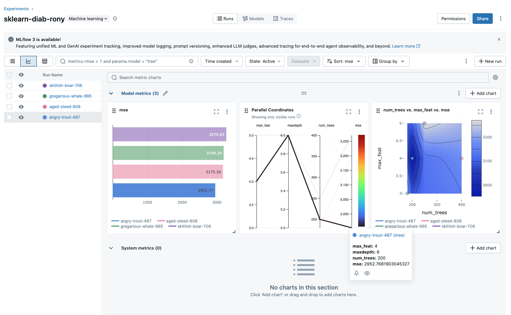
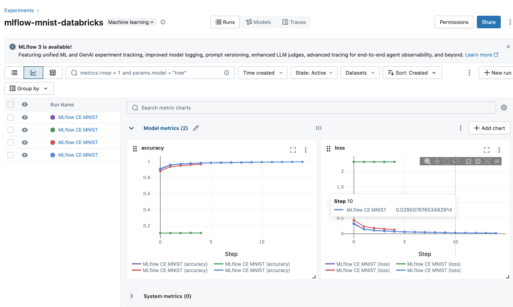

<p align="left">
  <a href="https://aws.amazon.com/es/" target="_blank">
    
  </a>
<a href="https://code.visualstudio.com/download" target="_blank">
    
  </a>
  <a href="https://awsacademy.instructure.com/login/canvas" target="_blank">
    
  </a>
  <a href="https://mlflow.org/" target="_blank">
    
  </a>
  <a href="https://www.databricks.com/learn/free-edition" target="_blank">
    
  </a>
    
  
</p>

# Guía de actividad práctica 5: MLflow

Es repositorio se complementó con [**AmazonWebServicesCLI**](https://github.com/HubertRonald/AmazonWebServicesCLI), para lanzar desde un **devcontainer local** una instancia **EC2** en el entorno de **AWS Academy**.  

> Todas las tecnologías utilizadas aquí corresponden a **free editions**.  

## Algunos resultados

- Modelo de [RandomForest](./notebooks/mlflow-diab-databricks.ipynb)

<p align="center">
    
</p>

- [Red Neuronal](./notebooks/mlflow-mnist-databricks.ipynb)
<p align="center">
    
</p>

## .gitignore

Fue generado en [gitignore.io](https://www.toptal.com/developers/gitignore/) con los filtros `python`, `macos`, `windows`, `jupyternotebooks` y consumido mediante su API como archivo crudo desde la terminal:

```bash
curl -L https://www.toptal.com/developers/gitignore/api/python,macos,windows,jupyternotebooks > .gitignore
```

## Autores

- **Hubert Ronald** - *Trabajo Inicial* - [HubertRonald](https://github.com/HubertRonald)

- Ve también la lista de [contribuyentes](https://github.com/HubertRonald/MIAD-DSA-2515-M35-MLflow/contributors) que participaron en este proyecto.